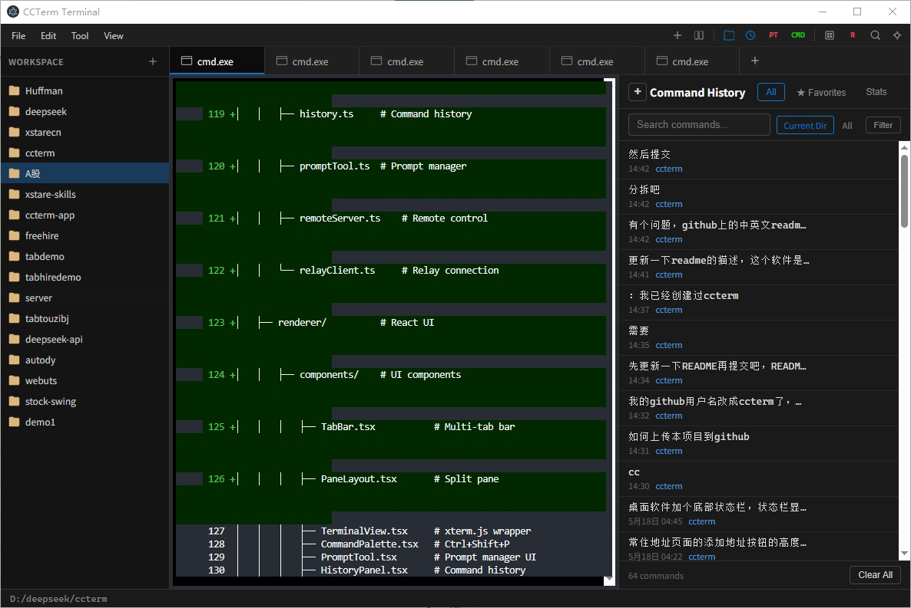

# CCTerm — Claude Code Super Terminal

> The ultimate terminal emulator purpose-built for **Claude Code** and AI-assisted programming.  
> Multi-tab, multi-shell, prompt-aware, mobile-ready.
>
> [中文文档](README_CN.md)



---

## 🎯 Why CCTerm?

Claude Code is powerful, but a single terminal window quickly becomes a bottleneck when you're juggling multiple AI tasks, switching between shells, and trying to remember which prompt goes where. CCTerm is built from the ground up to solve exactly these pains.

| Pain Point | CCTerm Solution |
|---|---|
| Single terminal, single task | **Multi-tab + split pane** — run Claude Code in multiple tabs simultaneously |
| Switching between PowerShell & CMD is tedious | **One-click shell switching** — freely switch shells per tab with a single click |
| Losing track of prompts | **Built-in Prompt Tool** — save, organize, and reuse your prompts |
| Can't resume yesterday's workspace | **Workspace & session persistence** — everything comes back exactly as you left it |
| Can't code from your phone | **Phone client + remote control** — connect to your terminal from anywhere |
| Hard to find past commands | **Search overlay + history panel** — search and replay any past command instantly |

---

## ✨ Features

### 🤖 AI Programming

- **Claude Code Optimized** — Designed with Claude Code workflows as the first-class use case. Run multiple Claude Code sessions across tabs, each in its own shell environment.
- **Prompt Tool** — Built-in prompt manager. Save frequently used prompts, categorize them, and inject them into any terminal with one click. No more copy-pasting from scattered notes.
- **Command History** — Full command history with search. Every prompt you've sent to Claude Code is logged and searchable.

### 📋 Multi-Task Management

- **Multi-Tab Terminal** — Create, close, switch, and drag-to-reorder tabs. Each tab runs an independent shell session. Run Claude Code in one tab, git operations in another, and a dev server in a third — all in one window.
- **Split Pane Layout** — Split the view into multiple panes side by side or stacked. Watch logs on one side while chatting with Claude Code on the other.
- **Workspace Manager** — Save your entire tab and pane layout as a named workspace. Switch between "Frontend Dev", "Backend Dev", and "Research" workspaces instantly.
- **Session Persistence** — Close CCTerm and reopen it — every tab, every pane, every command history comes back exactly as you left it.

### 🐚 Flexible Shell

- **PowerShell ↔ CMD One-Click Switch** — Each tab can run a different shell. Switch from PowerShell to CMD (or bash, zsh, WSL) with a single click in the tab context menu.
- **Auto Shell Detection** — Automatically detects available shells on your system: PowerShell, CMD, WSL, Git Bash, bash, zsh, fish, etc.

### 📱 Mobile Programming

- **QR Code Session Sharing** — Generate a QR code for any terminal session. Scan it with your phone to instantly access that session remotely.
- **Phone Client App** — Dedicated mobile companion app. Run commands, view output, and interact with Claude Code from your phone.
- **Remote Relay** — Built-in relay server ensures stable remote connections even behind NAT/firewalls.

### 🎨 User Experience

- **Command Palette** (`Ctrl+Shift+P`) — Quick fuzzy-search access to all commands and settings.
- **Search Overlay** — Search terminal buffer content with match highlighting, perfect for finding that one error message in a sea of output.
- **Customizable Profiles** — Per-shell profiles with custom fonts, colors, cursors, and startup commands.
- **Color Schemes** — Built-in popular schemes (Dracula, Solarized, Monokai, One Dark, etc.) plus custom scheme support.
- **Fully Configurable Keybindings** — Remap any action to your preferred keyboard shortcut.
- **Cross-Platform** — Windows, macOS, and Linux are all first-class citizens.

---

## 🛠 Tech Stack

| Layer | Technology |
|-------|------------|
| **Framework** | Electron + React 18 + TypeScript |
| **Terminal Engine** | xterm.js 6.x |
| **PTY** | node-pty (Windows-native) |
| **Build** | Webpack 5 |
| **State Management** | Zustand |
| **Networking** | WebSocket, Express |
| **Styling** | CSS Modules |

---

## 📦 Quick Start

### Prerequisites

- **Node.js** >= 18
- **npm** >= 9
- **Windows**: Node.js native build tools
- **macOS/Linux**: `python3`, `make`, `gcc`

### Install & Run

```bash
# Clone
git clone https://github.com/ccterm/ccterm.git
cd ccterm

# Install dependencies
npm install

# Build & launch
npm start
```

### Development Commands

```bash
npm start          # Build + launch
npm run build      # Dev build
npm run build:prod # Production build
npm run lint       # Type-check
```

---

## 📁 Project Structure

```
ccterm/
├── src/
│   ├── main/              # Electron main process
│   │   ├── shell.ts       # Shell / PTY management
│   │   ├── session.ts     # Terminal session
│   │   ├── workspace.ts   # Workspace manager
│   │   ├── history.ts     # Command history
│   │   ├── promptTool.ts  # Prompt manager
│   │   ├── remoteServer.ts    # Remote control
│   │   └── relayClient.ts     # Relay connection
│   ├── renderer/          # React UI
│   │   ├── components/    # UI components
│   │   │   ├── TabBar.tsx           # Multi-tab bar
│   │   │   ├── PaneLayout.tsx       # Split pane
│   │   │   ├── TerminalView.tsx     # xterm.js wrapper
│   │   │   ├── CommandPalette.tsx   # Ctrl+Shift+P
│   │   │   ├── PromptTool.tsx       # Prompt manager UI
│   │   │   ├── HistoryPanel.tsx     # Command history
│   │   │   ├── QrCodePanel.tsx      # QR code sharing
│   │   │   └── settings/            # Settings pages
│   │   ├── store/          # Zustand stores
│   │   └── styles/         # CSS styles
│   └── shared/            # Shared types
├── phone-client/          # Mobile client app
├── relay-server/          # Remote relay server
└── package.json
```

---

## 📄 License

MIT License

---

<p align="center"><b>CCTerm</b> — Built for Claude Code, made for AI programmers.</p>
